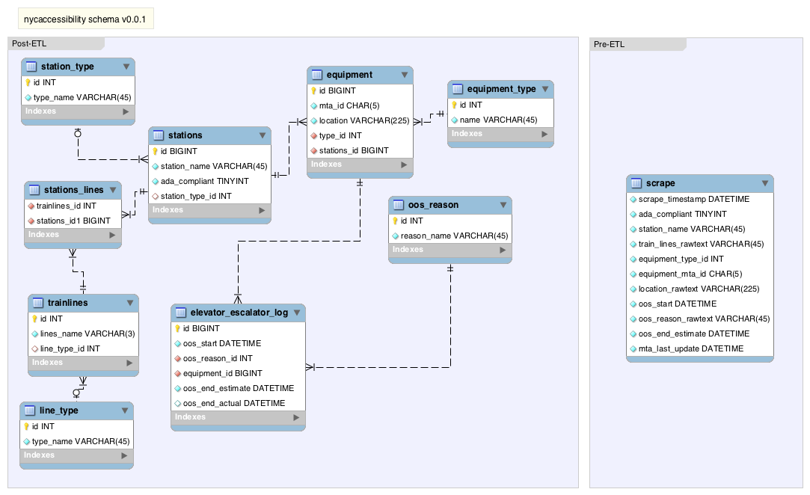

The database in this folder is intended to scrape data from [the MTA elevator and escalator outsage site](http://advisory.mtanyct.info/EEoutage/). Once scraped and loaded, an ETL script can clean the data and shred it into tidy tables. Those tables can be used to analyze or generate many statistics regarding MTA elevator and escalator outage times.

Still need to:
- Complete scraping script
- Create ELT script
- Put it all together and schedule processes in AWS

Documentation for contents of this folder:
- nycaccessibility_v_0_0_1.mwb contains the MySQL Workbench file which can be used to visually modify the schema
- nycaccessibility_schema_v_0_0_1.png is a snapshot of the schema at its latest version
- create_schema_nycaccessibility_v_0_0_1.sql is a script to create the schema on a MySQL database
- first_inserts_nycaccessibility_v_0_0_1.sql should be used immediately after the schema is created; it inserts some pre-known rows in relevant tables:
  + Equipment types
  + Line types
  + Station types
  + Out of service reasons
  + Train lines

Contacts:
@peconeto and @ilev on [nyc-accessibility Slack channel](https://datafordemocracy.slack.com/messages/nyc-accessibility/)

